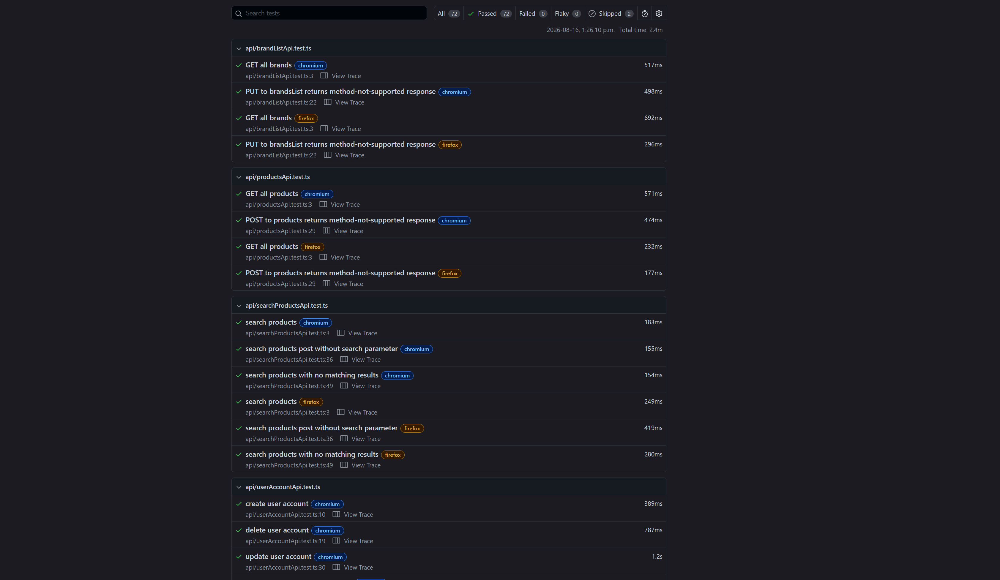

# Playwright E-Commerce Test Automation Framework

End-to-end test automation framework built with **Playwright and TypeScript** for testing an e-commerce web application.

The project demonstrates UI and API test automation using the Page Object Model (POM), reusable flows, fixtures, test data factories, API helpers, and component abstractions.

## Application Under Test

This framework tests the [Automation Exercise](https://automationexercise.com/) e-commerce practice application.

The application provides functionality for:

- User registration and authentication
- Product browsing and searching
- Product filtering
- Shopping cart operations
- Checkout and order placement
- Payment processing
- Account management
- Product reviews
- API endpoints for account and authentication functionality

## Tech Stack

- **Playwright**
- **TypeScript**
- **Node.js**
- **REST API testing**
- **Page Object Model (POM)**
- **Playwright fixtures**
- **Git / GitHub**

## Project Goals

This project was created to practice building a maintainable automated QA framework.

The framework focuses on:

- UI end-to-end testing
- API testing
- Page Object Model design
- Reusable test flows
- Test data generation
- Shared fixtures
- Component abstractions
- API helper functions
- Test cleanup and isolation
- Assertions and validation
- Cross-browser testing
- Playwright debugging and reporting

## Test Coverage

### UI Tests

The UI suite covers several major areas of the application.

#### Registration & Login

- Register a new user
- Prevent registration with an existing email
- Login with valid credentials
- Reject invalid login credentials
- Account deletion and cleanup

#### Products

- View product details
- Search for products
- Search for a product and add it to the cart
- Filter products by category
- Filter products by brand
- Submit a product review

#### Cart

- Add multiple products
- Add products with a selected quantity
- Remove products
- Add a recommended product from the homepage

#### Orders

- Register during checkout and complete an order
- Complete an order as an existing user
- Log out, log back in, and complete an order
- Verify billing and delivery addresses
- Download an invoice after purchase

#### Other UI Functionality

- Footer subscription
- Shared navigation components
- Account creation and deletion flows

### API Tests

The API suite covers account and authentication functionality, including:

- Create user account
- Update user account
- Delete user account
- Retrieve user details by email
- Verify login credentials
- Validate missing/invalid API parameters

## Example Test

The following test demonstrates how the framework combines fixtures, reusable flows, components, and Page Objects.

```ts
test("user can add multiple products to the cart", async ({
  addProductsToCartFlow,
  cartPage,
  addedToCartModal,
}) => {
  const products = await addProductsToCartFlow.addProducts([
    {
      id: "7",
      quantity: 3,
    },
    {
      id: "13",
      quantity: 6,
    },
  ]);

  await addedToCartModal.viewCart();
  await cartPage.verifyProducts(products);
});
```

The test intentionally contains only the actions and assertions relevant to the scenario.

The reusable `addProductsToCartFlow` handles the repeated process of navigating to product details, retrieving product information, setting quantities, and adding products to the cart.

The `AddedToCartModal` component handles interaction with the confirmation modal, while `CartPage` provides the page-specific validation used to verify the resulting cart contents.

This allows the test to remain focused on the behaviour being tested without duplicating lower-level implementation details.

## Framework Structure

```text
playwright-ecommerce/
│
├── components/
│   ├── addedToCartModal.ts
│   ├── footer.ts
│   ├── navbar.ts
│   └── ...
│
├── fixtures/
│   └── fixtures.ts
│
├── flows/
│   ├── addProductsToCartFlow.ts
│   └── registrationFlow.ts
│
├── pages/
│   ├── accountCreatedPage.ts
│   ├── cartPage.ts
│   ├── checkoutPage.ts
│   ├── homepage.ts
│   ├── loginPage.ts
│   ├── productDetailsPage.ts
│   ├── productsPage.ts
│   └── ...
│
├── test-data/
│   ├── factories.ts
│   ├── products.ts
│   ├── users.ts
│   └── ...
│
├── tests/
│   ├── api/
│   │   ├── accountApi.test.ts
│   │   ├── verifyLoginApi.test.ts
│   │   └── ...
│   │
│   └── ui/
│       ├── cartTests.test.ts
│       ├── footer.test.ts
│       ├── orderTests.test.ts
│       ├── productTests.test.ts
│       └── registrationTests.test.ts
│
├── utils/
│   ├── api/
│   │   ├── accountApi.ts
│   │   └── accountTestHelpers.ts
│   │
│   └── ui/
│       └── accountCleanup.ts
│
├── playwright.config.ts
├── package.json
└── README.md
```

## Test Results

The test suite currently contains 74 tests across Chromium and Firefox.



## Known Limitations

The application under test is an external practice e-commerce site, so test reliability is affected by the availability and performance of the application itself.

During development, the following application-level issues were observed:

- The website can experience periods of slow loading or temporary unavailability.
- Network requests from the application can occasionally be slow or fail.
- Some UI tests may therefore fail because the application has not loaded or responded within the expected time.
- The contact form is intermittently unreliable in Chromium. In particular, the browser confirmation prompt does not consistently behave as expected, making the test unsuitable for reliable inclusion in the full test suite.
- These issues were investigated using Playwright traces, screenshots, headed execution, and repeated test runs.
